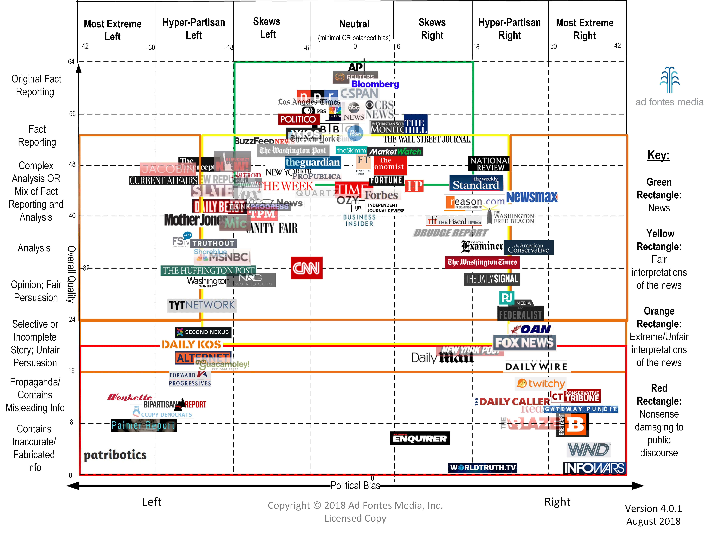

> ~~“假使这些完全无中生有的东西，你再帮他们说一遍，你等于，你也有责任”~~

最近有几件事我感触有点深。

第一件事是女朋友发了一个微博上某著名媒体对澳洲的报道，问我是真的假的。我顺手看了下几个澳洲媒体的报道，杀骆驼是真的，大火也是真的，但报道的结论是假的，不过记者表现出的那种戏虐心态是真的。

第二件事是一个公众号作者群里有人写了一篇关于 19 世纪最后一次鼠疫在东亚流行的文章，我顺手翻了一下资料，指出了一些问题，并且附上了参考链接。但是被群友质疑，并表示链接打不开。我也很为难，因为我突然意识到没办法教他打开维基百科的链接。

现在面临的不是信息爆炸问题，而是 fake news。

造成这种状况的有三种人：

第一种人很坏，他们很懂 propaganda[^1]，他们以不公正、不准确的信息以及对信息的误读来影响大众，改变大众对某一事件或者观点的立场或态度，使得他们在其中获益。

第二种人是韭菜，他们是真心喜欢参与点赞和转发的狂欢。

第三种人内心是善良的，但由于身边太多 fake news，他们想到的、写出来的东西就很难让人接受。

---

怎么对付 fake news 呢，我的朋友 @chenshaoju 教我 fact checking[^1]。

fact checking 本质上是建立一个信息处理机制。不依赖于任何消息源，而是依赖一套符合逻辑的评价手段，并以此手段对待所有的消息源，排除其中的偏见、误导、欺诈、错误，以此还原出更加客观的信息。

---

fact checking 有什么用呢？只有客观有效的信息才能帮你建立有效的决策，帮你赚到钱或避开风险。所以 fact checking 就是一个帮你赚到钱或避开风险最基础的过程。

举个例子，前两天，我的朋友橘子君在他同事们的质疑和嘲讽的目光中早早就买好了口罩，因为他察觉到了 2019-nCov 的实际传播情况与媒体报道之间的差异；而到今天，他的同事们不得不开始抢购翻倍涨价的口罩。

## 1 尽可能看原始来源

看过综艺节目中的“我比划你猜”游戏的人都知道，消息在传递过程中保持不变是很困难的，因此第一手信息的可信度为最高。

我们在对任何一个消息进行 fact checking 时，都应优先考虑最原始的第一手信息。所以在“五条”中，我固执地让大家去看原文，而不仅仅是读我的简评。因为我会出错或者遗漏，甚至有可能对原文中的人或者事有偏见，甚至五条的筛选也会包含我的个人偏好——那是必然的。

这一点是如此重要，甚至可以升级为中国大陆互联网生存准则。在现在的舆论环境中，几乎找不到任何一个媒体信息来源可以让人可以放心地降低 fact checking 的成本。

## 2 尽可能从不同的视角了解同一个消息

中国有一句古话 “兼听则明，偏信则暗[^3]”。这句话告诉我们从多个不同的角度才能更好的还原事物的样子，才能做出正确的事情；只听信单方面的话，就分不清是非。

对待信息也应如此。

信息源也有自身的价值观和利益，他们在传递或者解读消息时，对其中的一部分内容进行扭曲或者“有意无意的编排”是很常见的事情。

因此在阅读任何一个信息时，如果能理解对方的立场，就能更好地理解这一视角下信息的面目；更进一步，如果能理解不同方的立场，就能综合各方视角，对信息得到更加全面的理解。

下图展示了美国主流媒体的立场（Media Bias）。

中文媒体没有什么 Bias。

## 3 区分事实和观点

事实是一种客观存在，你可以可验证其真实存在与否；观点是个人看法，你可以同意或者不同意一个观点，但是你不能证明或者证伪一个观点的存在。

观点和事实常常交织出现在任何信息中，包括新闻、广告、书籍等等，比如写文章常会用事实来支撑我们的观点，但从行文中表现的偏好和偏见中提取出可验证的真相就很困难。

不过信息中的用词能提供有用的线索，有助于识别一个陈述是基于事实，或是基于观点。

更可能是事实的论述方式有：

- 这份报告**确认**了如下情况…
- 科学家最近**发现**了……
- **根据**测试结果可以得出结论……
- 本次调查结果**证明**了……

更可能是观点的论述方式有：

- 某人**声称**……
- 某人发表了**看法**……
- 报告**认为**……
- 一些科学家**怀疑**……

## 4 理解概率

假如现在桌子上有一张纸条遮住了铅笔中的一部分，只露出头部和尾部。现在请问，被纸条遮住的部分是什么样子？

这个问题有很多符合逻辑的解答，比如下图所示都是可能的：

但是我们基于对“铅笔”这一常识的理解——铅笔是一种笔直的棍状物体——可以很快得出结论：很大的可能性，应该选择图 1。

注意，图1仅仅表示基于现有的信息下，这个回答有更大的概率是正确的，并不意味着图1一定的正确的。比如说，如果有一个新的信息：你有一个特别喜欢作弄人的同事，他在这件事上作弄你也有一个概率，那么基于这个新的信息，图1正确的概率也会发生变化，这是贝叶斯定理[^4]。

既然概率不能保证必胜，那为什么我们要理解概率？原因很简单：在足够长的时间里，你会基于这些信息作出很多很多次判断，如果你的判断正确率总是 > 50%，那么这些信息给你带来的收益才会是一个正值。

## 5 严谨的思考

在 80 年代停止中小学逻辑学课程后，我们中很多人都缺少建立和评估逻辑的意识，也失去培养这种思维方式的机会，那就是“Critical thinking[^5]”

在汉语语境中，Critical thinking 被翻译成“批判性思维”，会让人联想到负面的“批评”（criticize），其实与它的原定义有所差距。更好的翻译应该是“逻辑清晰严密的思考”。

很多人尝试给它一个明确的定义，比如：

> Critical thinking 是一种有目的而自律的判断，并对判断的基础就证据、概念、方法学、标准釐定、背景因素层面加以诠释、分析、评估、推理与解释。

在处理信息这件事上，Critical thinking 就是对以上四点的处理方法：

认知务求全面周到，能坦然面对偏见，判断必求证据谨慎，必要时能重新思量，专注于探索问题本身，而且坚持在变化的条件下寻求更精确的结果。

另外，Critical thinking 并不是去“找茬”——实际上，一旦发现别人的问题和缺陷就认为自己掌握着真理的想法是完全错误的——我们可能需要足够的信息才能达到与他人相同的决策高度，才能有机会理解这件事。

> 后记：
>
> 关于本文刚开始写的第二个故事，经叫兽提点，可能是因为挡了群友的财路，是我不对，特此向群友道歉。

[^1]: Propaganda, https://en.wikipedia.org/wiki/Propaganda
[^2]: Fact checking, https://en.wikipedia.org/wiki/Fact-checking#Informal_fact-checking
[^3]: 《[资治通鉴]·唐太宗贞观二年》：问 魏徵 曰：人主何为而明，何为而暗？对曰：兼听则明，偏信则暗。
[^4]: 贝叶斯定理， https://en.wikipedia.org/wiki/Bayes%27_theorem
[^5]: Critical Thinking, https://en.wikipedia.org/wiki/Critical_thinking

