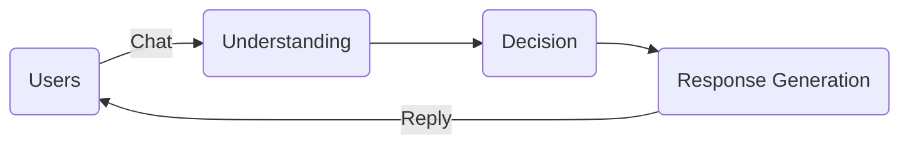

In the [previous post](https://gitpress.io/@lyric/mixin-bot-development-tutorial-1-run-a-bot-from-scratch), I introduced the basic knowledge you need to know to create a bot, and then run a very simple bot, which replies every message the user sends to it.

To use the functions of bots, users often need to perform several steps to interact with bots. The developers usually provide two different ways to let the bots interact with users: chat mode and web UI.

The bot's chat mode that's designed to simulate a regular user conversation, just like how the previous example works. Users communicate with bot using a chat interface via text, pictures, voice, etc, just like they would talk with another person.

During the conversation, the bot keeps a session for each user and interpret each message sent to it by them, and provide answers.

There are obviously several benefits of chat mode: It's always online and can continue to serve users every day without break; and it can do repetitive work automatically.

Here is a figure that shows how bots work on chat mode:



According to the figure, we can see two roles and three key concepts in the interpret process. The two roles are `users` and `bot`, obviously. The three key concepts are `Understanding`, `Decision`, and `Response generation`.

Because our last goal is a bot with trading feature, the bot should understand the purpose of trading. If you have trade cryptocurrency before, it's easy to summarize a regular trading purpose:

1. One kind of crypto I want to get, let's call it `A`;
2. Another kind of crypto I can give, let's call it `B`;
3. The amount of crypto I can give, let's call it `x`;
4. The affordable price. We just ignore it because we will use an AMM to trade, which will calculate a price automatically.

So the result of summarization is that:

1. the user should specified `A` in the chat;
2. the user transfer `x`   `B` to the bot;
3. the bot receive the `x` `B` and swap them all to `A`;
4. the bot transfer `A` to the user.


## Manage User Sessions

In Mixin Messenger, the transfer is an individual message type, which means we can't gather all information in a signal response.

So the bot must ask the user for two information:  `A`, which crypto the user want; and `x` `B`, how much and which assets the user will provide.

The entire conversation should look like that:

```
Bot:
Hi, which crypto do you want? Please respond with the symbol (BTC, ETH, etc)

Human:
BTC

Bot:
The price of BTC (Bitcoin) is $54999, tap the "swap" link to continue.
[Swap to BTC]

Human:
(tap the "swap" button to invoke a transfer view)
(transfer 1 ETH to the bot)
(complete the transfer)

Bot:
Swap BTC with 1 ETH. The price is 1 BTC ~ 19.44890442 ETH.
(...)
(transfer 0.0508784 BTC to the user)
```

Because the bot may serve a lot of users at the same time, it should "remember" all the preferences of users. The bot's memory is called "session".

Here, each session is a "note" for the bot which includes "who" want "which crypto".

If the user start a conversation and continue the dialogue and transfer money to the bot, the bot will look up the user identity (aka, userID) in the "note", and find that which crypto this guy want and trade, and close the session in the end.

If the user leave the chat, the bot should set a timeout for the session. If the timeout reached, the session should be close too.

That's called Session Management. I use the `go-cache` module to implement the user sessions in a new source file named "session.go":

```go
package main

import (
	"time"

	"github.com/patrickmn/go-cache"
)

var (
	// Set the default expiration to 10 minutes
	SessionCache = cache.New(time.Minute*10, cache.NoExpiration)
)

const (
	// the init state
	UserSessionStateInit = 0
	// the state that users tell bot what them want
	UserSessionStateSpecifiedSymbol = 1
)

type UserSession struct {
	State int
	// Symbol and AssetID will be available when State == UserSessionStateSpecifiedSymbol
	Symbol  string
	AssetID string
}

func setSession(userID string, sess *UserSession) {
	SessionCache.Set(userID, sess, cache.DefaultExpiration)
}

func getSession(userID string) *UserSession {
	if x, found := SessionCache.Get(userID); found {
		return x.(*UserSession)
	}
	return nil
}
```

Implementing of `session.go` is straightforward. You will see how I use it in the code.

## Handle Messages

Do you still remember the `h` function to handle incoming messages in `main.go`? To let the bot understand and make decisions, I change it slightly:

```go
	h := func(ctx context.Context, msg *mixin.MessageView, userID string) error {
		// if there is no valid user id in the message, drop it
		if userID, _ := uuid.FromString(msg.UserID); userID == uuid.Nil {
			return nil
		}

		if msg.Category == mixin.MessageCategorySystemAccountSnapshot {
			// if the message is a transfer message
			// and it is sent by other users, then handle it
			if msg.UserID != client.ClientID {
				return handleTransfer(ctx, msg)
			}
			// or just drop it
			return nil
		} else if msg.Category == mixin.MessageCategoryPlainText {
			// if the message is a text message
			// then handle the message
			return handleTextMessage(ctx, msg)
		} else {
			return askForSymbol(ctx, msg)
		}
	}
```

You can see that I add some sentences to handle messages under different conditions. The common conditions are message's `Category`.

There are series of Categories in Mixin Messenger. In the code above, two kinds of categories I used in the condition judgement, they are `MessageCategorySystemAccountSnapshot` and `MessageCategoryPlainText`.

The former indicates the message is a "transfer message", and the latter means that it's a "plain text message".

For the "transfer message", there is a function called `handleTransfer` to handle them. Because we are not ready to handle money yet, let's talk about it in the next post.

For the "text message", here is the implementation of the `handleTextMessage`:

```go
func handleTextMessage(ctx context.Context, msg *mixin.MessageView) error {
	// Decode the message content
	msgContent, err := base64.StdEncoding.DecodeString(msg.Data)
	if err != nil {
		return err
	}

	// Is it "cancel"? if so, reset the session
	if strings.ToUpper(string(msgContent)) == "CANCEL" {
		if err := askForSymbol(ctx, msg); err != nil {
			return respondError(ctx, msg, fmt.Errorf("Failed to ask for the asset symbol: %s", err))
		}
		return nil
	}

	// Try to get the user's session
	session := getSession(msg.UserID)
	if session == nil {
		// No existed session, this is a new user. Ask the user for the asset symbol.
		if err := askForSymbol(ctx, msg); err != nil {
			return respondError(ctx, msg, fmt.Errorf("Failed to ask for the asset symbol: %s", err))
		}
	} else {
		// There is an existed session
		if session.State == UserSessionStateInit {
			// If the user hasn't tell the bot which crypto them want, ask the user to transfer.
			if err := askForPayment(ctx, msg); err != nil {
				return respondError(ctx, msg, fmt.Errorf("Failed to ask for payment: %s", err))
			}
		} else {
			// tell user to complete the payment or be patient.
			if err := respondHint(ctx, msg, session); err != nil {
				return respondError(ctx, msg, fmt.Errorf("Failed to ask for payment: %s", err))
			}
		}
	}
	return nil
}
```

The `handleTextMessage` function is a bit complex, actually it only leads to 4 cases:

1. if the user inputs "cancel", reset the session.
2. if the user starts a new session, ask for the symbol.
3. if there is an existed session, and hasn't asked for payment, then ask.
4. if there is an existed session, and has already asked for payment, then send a hint.

For each case, there is a function to handle the messages, they are `askForSymbol`(used in case #1 and #2), `askForPayment` (used in case #3) and `respondHint` (used in case #4). Besides, the function `respondError` is used in all error handling process if something goes wrong.

### Ask User to Specify an Asset's Symbol

The bot uses `askForSymbol` function to invoke `respond` to ask user to reply a symbol of asset, for example, BTC or ETH. This function also sets sessions for users.

```go
func askForSymbol(ctx context.Context, msg *mixin.MessageView) error {
	// Set a session for this guy
	setSession(msg.UserID, &UserSession{
		State: UserSessionStateInit,
	})
	data := "Hi, which crypto do you want? Please reply the symbol (BTC, ETH, etc)"
	return respond(ctx, msg, mixin.MessageCategoryPlainText, []byte(data), 1)
}
```

It uses widely the `respond` function in the bot, you can see its implementation later.

### Ask User to Transfer

If the bot receives a message and the user's session is in the "init" state, the bot will respond a text and a button with a link to ask the user to transfer crypto to it.

Here the code does a sequence of actions:

- Decode the message's `data` field, it's user's input, assumed as the symbol of specified asset.
- Get the asset's information from Mixin API via `getAssetBySymbol`.
- Set user's session to next state, put the assetID and symbol in the session object.
- Reply users with a hint of payment.
- Reply users with a tappable button which user can tap it and invoke the transfer view.

```go
func askForPayment(ctx context.Context, msg *mixin.MessageView) error {
	content, err := base64.StdEncoding.DecodeString(msg.Data)
	if err != nil {
		return err
	}

	// get the asset according to user's input
	asset, err := getAssetBySymbol(ctx, strings.TrimSpace(string(content)))
	if err != nil {
		return err
	}

	// move to next state
	setSession(msg.UserID, &UserSession{
		State:   UserSessionStateSpecifiedSymbol,
		Symbol:  asset.Symbol,
		AssetID: asset.AssetID,
	})

	// send the hint
	data := fmt.Sprintf("The price of %s (%s) is $%s, tap the \"swap\" link to continue.", asset.Symbol, asset.Name, asset.PriceUSD)
	if err := respond(ctx, msg, mixin.MessageCategoryPlainText, []byte(data), 1); err != nil {
		return err
	}

	// send the swap button
	buttons := fmt.Sprintf(`[{
    "label": "Swap to %s",
    "color": "#00BBFF",
    "action": "mixin://transfer/%s"
 	}]`, asset.Symbol, client.ClientID)
	return respond(ctx, msg, mixin.MessageCategoryAppButtonGroup, []byte(buttons), 2)
}
```

There are two takeways I'd like to explain more in the code:

**Get asset Info by asset's symbol**

All assets related operations are based on an UUID, it's called assetID. The assetID is unique, so it's safe to identify any asset. For example, Bitcoin's assetID in Mixin Network is `c6d0c728-2624-429b-8e0d-d9d19b6592fa`.

However, it's impossible for people to memorize UUIDs. So we need to transform the user's input, the symbol of asset, into an asset object, which contains the asset ID.

I wrote the `asset.go` file, which includes the implementation of the entire process. There are two functions called by `main.go`, they are `getAssetBySymbol` and `initAssets`.

I won't explain more detail about this file this time. You can dive in if you are interested in it.

**App Button Group Message**

As you can see, the 2nd message that the bot sends is a `MessageCategoryAppButtonGroup` message. Mixin Messenger shows this kind of message as one or more buttons with labels.

Users can tap the buttons and invoke an action according to the `action` field.

If the `action` field is a link and you have put the prefix of the link in the "Developer Dashboard - Resource patterns", it will open the link in a web view.

If the `action` field is a supported Mixin scheme which starts with `mixin://`, it will invoke a view of Mixin Messenger.

For example, in this bot's code, the action is `mixin://transfer/BOT_CLIENT_ID`. It means Mixin Messenger will open the transfer view for transferring to an account. The account is specified by `BOT_CLIENT_ID`.

### Send a Hint to Users

The `respondHint` is straightforward too. Like the `askForSymbol` function, it just sends a text to the user.

```go
func respondHint(ctx context.Context, msg *mixin.MessageView, session *UserSession) error {
	msgTpl := `You choose to swap for %s, please transfer any crypto to the bot.
If you already transfered, please wait for a moment. It may cost time to swap.
If you want to cancel the swapping, please reply "cancel".`
	data := fmt.Sprintf(msgTpl, session.Symbol)
	return respond(ctx, msg, mixin.MessageCategoryPlainText, []byte(data), 1)
}
```

### The `respond` Function

The `respond` function is a modification version of the code in previous post. It charges for sending messages.

```go
func respond(ctx context.Context, msg *mixin.MessageView, category string, data []byte, step int) error {
	payload := base64.StdEncoding.EncodeToString(data)
	id, _ := uuid.FromString(msg.MessageID)
	// Create a request
	reply := &mixin.MessageRequest{
		ConversationID: msg.ConversationID,
		RecipientID:    msg.UserID,
		MessageID:      uuid.NewV5(id, fmt.Sprintf("reply %d", step)).String(),
		Category:       category,
		Data:           payload,
	}
	// Send the response
	return client.SendMessage(ctx, reply)
}
```

## Summary

In this article, I introduced the basic user-interact method of Mixin bot: chatting.

The next step, I'd explain more details about how transfers done in Mixin Network, and let this bot correctly handle the crypto asset transfers, and do the real trading at [4swap](https://4swap.org).

If you want to contribute to this tutorial and make it better, your help is very welcome. Please fork [this source code](https://github.com/lyricat/mixin-tutorial/) and discuss with me at [Github discussions](https://github.com/lyricat/mixin-tutorial/discussions).